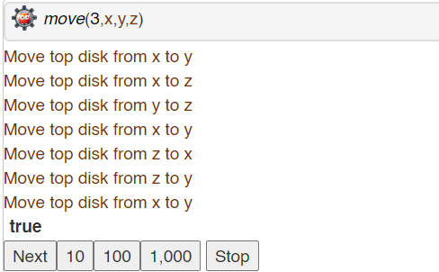

<<<<<<< HEAD:Ex.No09_ComputerMaintenance.md
# Ex.No: 11  Logic Programming –  Computer Maintenance Expert System
=======
# Ex.No: 11 Logic Programming –  Computer Maintenance Expert System
>>>>>>> 974f1dd5cec842c3ff0e228ee360e12e4159140a:Ex.No9_ComputerMaintenance.md
### DATE: 19.09.2024                                                               
### REGISTER NUMBER : 212222040101
### AIM: 
Write a Prolog program to build a computer maintenance expert system.
###  Algorithm:
1. Start the program.
2. Write the rules for each fault in computer.
3. If system have printing problem, missing dots and no uniform printing then system fault on printer head.
4. If system have not printing, missing dots and spread inks then system fault on ribbon
5. If system have not printing, paper jam and out of paper then system fault on paper stuck in printer
6. Similarly define rules for all faults.
7. Define facts for system problems.
8. Find the fault of computer by passing query to system.
     
### Program:
```
fault(printer_head) :-
	problem(not_printing),
	problem(missing_dots),
	problem(nonuniform_printing).
fault(ribbon) :-
	problem(not_printing),
	problem(missing_dots),
	problem(spread_ink).
fault(paper) :-
	problem(not_printing),
	problem(paper_jam),
	problem(out_of_paper).
fault(motherboard) :-
	problem(long_beep),
	problem(short_beep).
fault(hard_disc) :-
	problem(two_short_beeps),
	problem(blank_display).
problem(not_printing).
problem(missing_dots).
problem(spread_ink).
problem(two_short_beeps).
problem(blank_display).

```
### Output:




### Result:
Thus the simple omputer maintenance expert system was built sucessfully.
