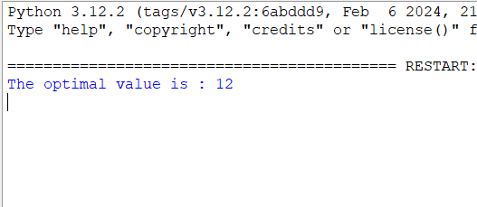

# Ex.No: 3  Implementation of Minimax Search

### DATE: 22.08.2024	                               

### REGISTER NUMBER : 212222040101

### AIM: 
Write a mini-max search algorithm to find the optimal value of MAX Player from the given graph.
### Algorithm:
1. Start the program
2. import the math package
3. Specify the score value of leaf nodes and find the depth of binary tree from leaf nodes.
4. Define the minimax function
5. If maximum depth is reached then get the score value of leaf node.
6. Max player find the maximum value by calling the minmax function recursively.
7. Min player find the minimum value by calling the minmax function recursively.
8. Call the minimax function  and print the optimum value of Max player.
9. Stop the program. 

### Program:

```py

import math
def minimax (curDepth, nodeIndex,
             maxTurn, scores,
             targetDepth):
    # base case : targetDepth reached
    if (curDepth == targetDepth):
        return scores[nodeIndex]
    if (maxTurn):
        return max(minimax(curDepth + 1, nodeIndex * 2,
                    False, scores, targetDepth),
                   minimax(curDepth + 1, nodeIndex * 2 + 1,
                    False, scores, targetDepth))
     
    else:
        return min(minimax(curDepth + 1, nodeIndex * 2,
                     True, scores, targetDepth),
                   minimax(curDepth + 1, nodeIndex * 2 + 1,
                     True, scores, targetDepth))
     
# Driver code
scores = [3, 5, 2, 9, 12, 5, 23, 20]
treeDepth = math.log(len(scores), 2) # calculate depth of node  log 8 (base 2) = 3)
print("The optimal value is : ", end = "")
print(minimax(0, 0, True, scores, treeDepth))

```

### Output:



### Result:
Thus the optimum value of max player was found using minimax search.
